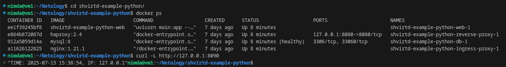
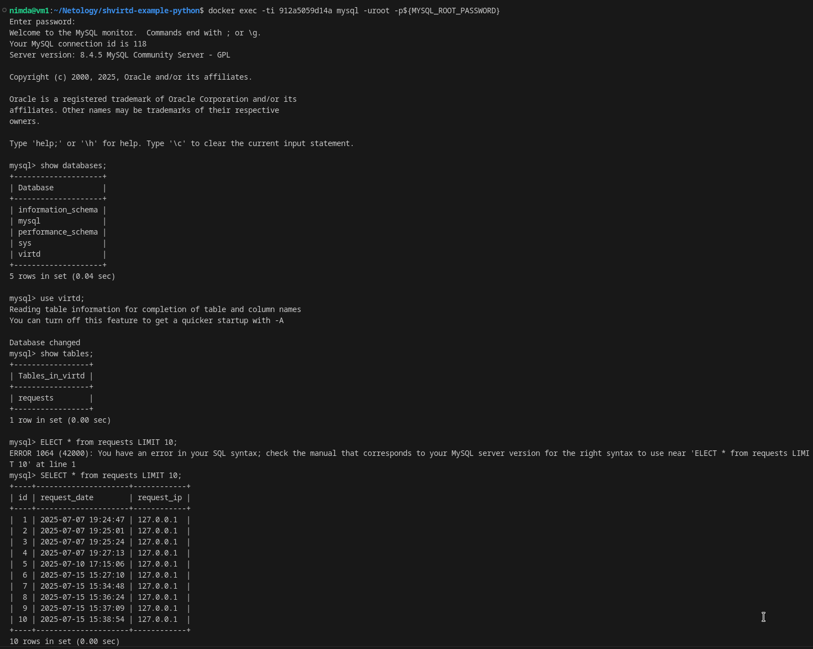
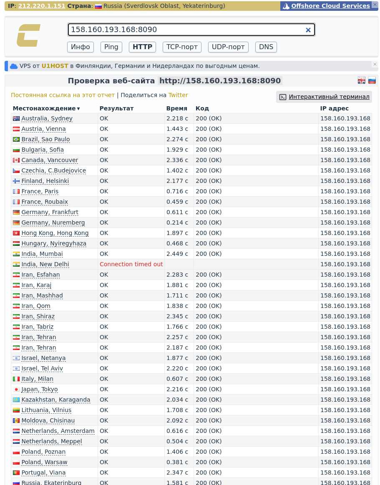
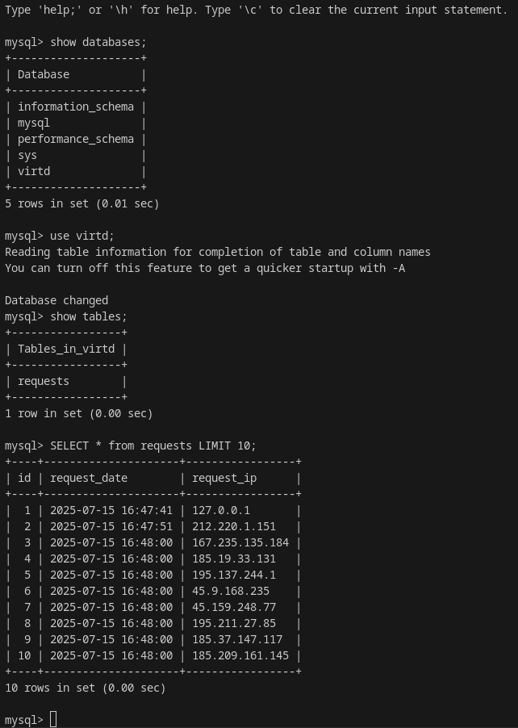

#  "Практическое применение Docker" - `Горелов Николай`

## Задача 0

1. Проверка отсутствия docker-compose (с тире):
```bash
docker-compose --version
```
Получаем ожидаемую ошибку:
```
bash: docker-compose: команда не найдена
...
```

2. Проверка наличия docker compose (без тире) версии не менее v2.24.X:
```bash
docker compose version
```
Вывод:
```
Docker Compose version v2.37.3
```


---

## Задача 1

1. Создан файл `Dockerfile.python`:
```dockerfile
FROM python:3.12-slim

WORKDIR /app

COPY . .

RUN pip install --no-cache-dir -r requirements.txt

# CMD ["uvicorn", "main:app", "--host", "0.0.0.0", "--port", "5000"]
CMD ["python", "main.py"]
```

2. Создан файл `.dockerignore`:
```
.git
.gitignore
.env
__pycache__
*.pyc
*.pyo
*.pyd
.DS_Store
```

3. Проверка сборки:
```bash
docker build -t python-app -f Dockerfile.python .
docker run -d -p 5000:5000 python-app
```

---

 ## Задача 2 (*)


---

## Задача 3

1. Создан файл `compose.yaml`:
```yaml
include:
  - proxy.yaml

services:
  web:
    build:
      context: .
      dockerfile: Dockerfile.python
    networks:
      backend:
        ipv4_address: 172.20.0.5
    restart: always
    environment:
      DB_HOST: db
      DB_USER: ${DB_USER}
      DB_PASSWORD: ${DB_PASSWORD}
      DB_NAME: ${DB_NAME}
    depends_on:
      - db

  db:
    image: mysql:8
    networks:
      backend:
        ipv4_address: 172.20.0.10
    restart: on-failure
    environment:
      MYSQL_ROOT_PASSWORD: ${MYSQL_ROOT_PASSWORD}
      MYSQL_DATABASE: ${DB_NAME}
      MYSQL_USER: ${DB_USER}
      MYSQL_PASSWORD: ${DB_PASSWORD}
    volumes:
      - mysql_data:/var/lib/mysql

networks:
  backend:
    driver: bridge
    ipam:
      config:
        - subnet: 172.20.0.0/16

volumes:
  mysql_data:
```

2. Запуск проекта:
```bash
docker compose up -d
```

3. Проверка работы:
```bash
curl -L http://127.0.0.1:8090
```

4. Подключение к БД и выполнение запросов:
```bash
docker exec -ti <container_id> mysql -uroot -p${MYSQL_ROOT_PASSWORD}
```
SQL запросы:
```sql
show databases;
use virtd;
show tables;
SELECT * from requests LIMIT 10;
```




---

## Задача 4

1. Создана ВМ в Yandex Cloud
2. Создан bash-скрипт `deploy.sh`:
```bash
#!/bin/bash

REPO_URL="https://github.com/gorelovniko/shvirtd-example-python"
TARGET_DIR="/opt/app"

# Install dependencies
apt-get update
apt-get install -y git docker.io

DOCKER_CONFIG=${DOCKER_CONFIG:-$HOME/.docker}
mkdir -p $DOCKER_CONFIG/cli-plugins
curl -SL https://github.com/docker/compose/releases/download/v2.38.2/docker-compose-linux-x86_64 -o $DOCKER_CONFIG/cli-plugins/docker-compose
chmod +x $DOCKER_CONFIG/cli-plugins/docker-compose

REAL_USER=$(logname)
usermod -aG docker $REAL_USER
systemctl restart docker

# Clone repository
git clone $REPO_URL $TARGET_DIR
cd $TARGET_DIR

# Start services
docker compose up -d
```

3. Проверка работы через https://check-host.net/check-http





Ссылка на fork репозитория: `https://github.com/gorelovniko/shvirtd-example-python`

---

## Задача 5 (*)


---

## Задача 6


---

## Задача 6.1


---

## Задача 6.2 (**)


---

## Задача 7 (***)


---