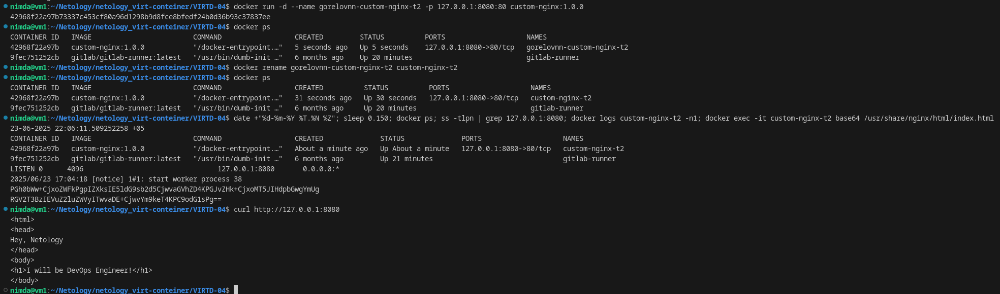
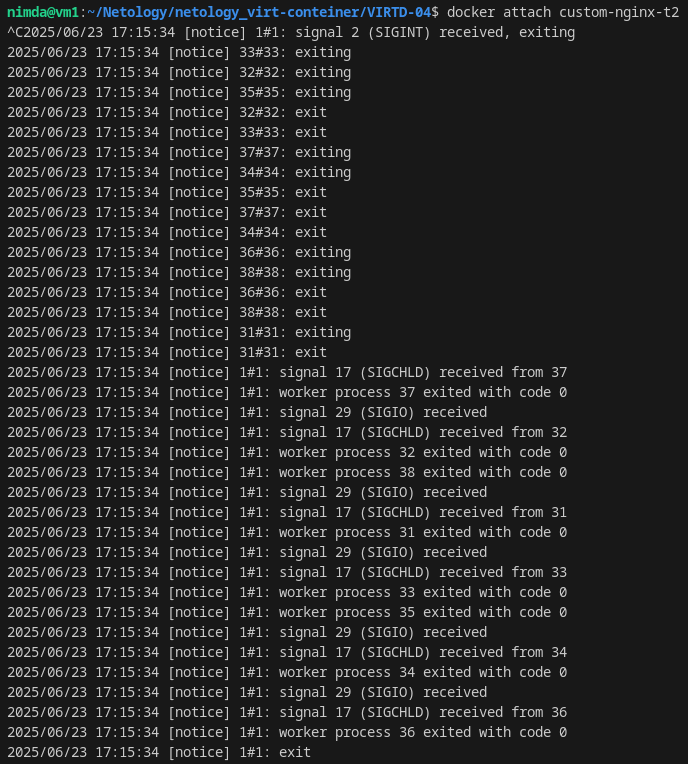
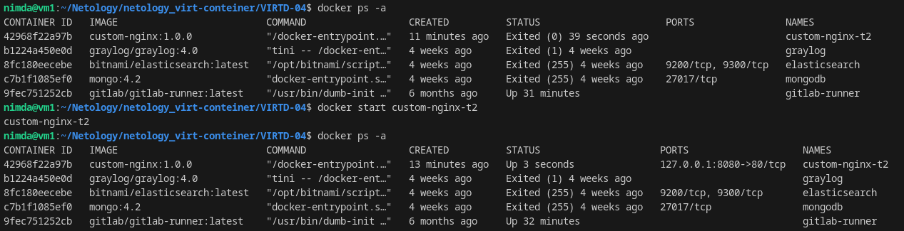
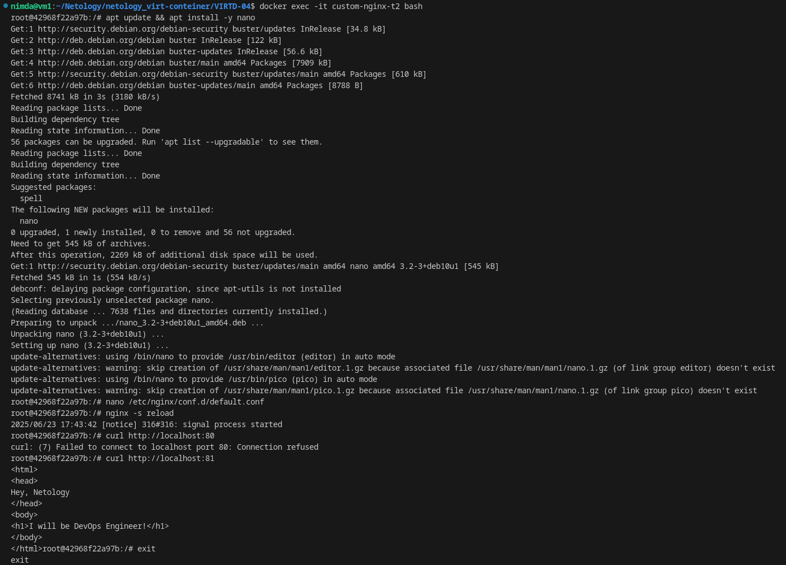
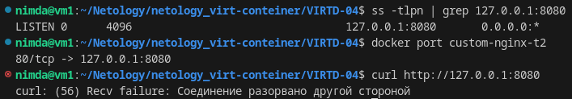
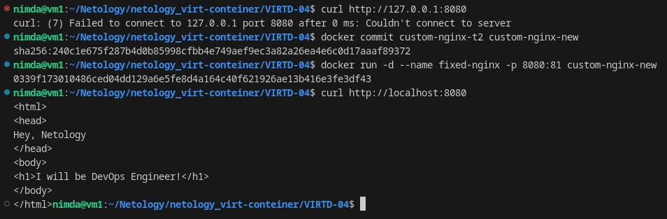
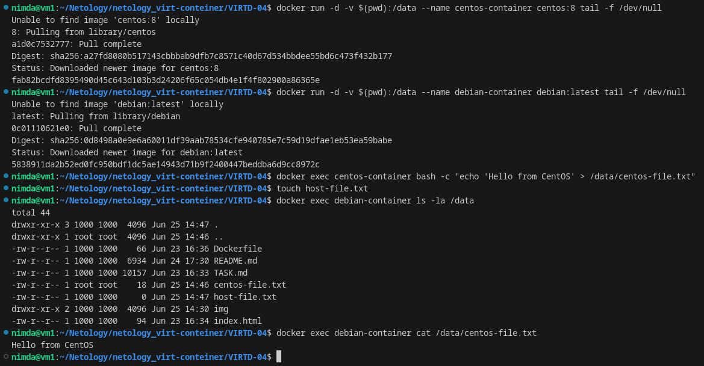
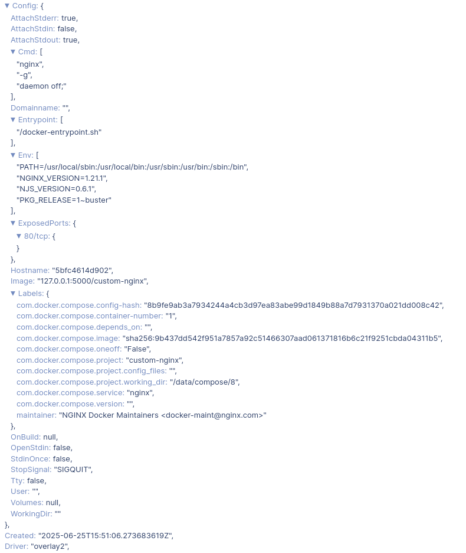
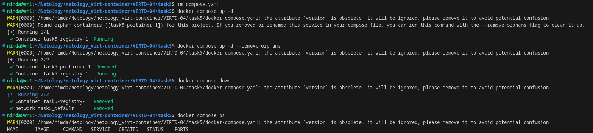

# Домашнее задание к занятию 4 «Оркестрация группой Docker контейнеров на примере Docker Compose» - `Горелов Николай`

## Задача 1

### Установка Docker и Docker Compose Plugin

Установка Docker и Docker Compose Plugin на Debian:

```bash
# Установка зависимостей
sudo apt-get update
sudo apt-get install -y \
    ca-certificates \
    curl \
    gnupg \
    lsb-release

# Добавление официального GPG ключа Docker
sudo mkdir -p /etc/apt/keyrings
curl -fsSL https://download.docker.com/linux/debian/gpg | sudo gpg --dearmor -o /etc/apt/keyrings/docker.gpg

# Добавление репозитория Docker
echo \
  "deb [arch=$(dpkg --print-architecture) signed-by=/etc/apt/keyrings/docker.gpg] https://download.docker.com/linux/debian \
  $(lsb_release -cs) stable" | sudo tee /etc/apt/sources.list.d/docker.list > /dev/null

# Установка Docker и Docker Compose Plugin
sudo apt-get update
sudo apt-get install -y docker-ce docker-ce-cli containerd.io docker-compose-plugin
```

### Создание Dockerfile и сборка образа

Создаем `Dockerfile`:

```dockerfile
FROM nginx:1.21.1
COPY index.html /usr/share/nginx/html/index.html
```

Создаем `index.html`:

```html
<html>
<head>
Hey, Netology
</head>
<body>
<h1>I will be DevOps Engineer!</h1>
</body>
</html>
```

Собираем образ:

```bash
docker build -t custom-nginx:1.0.0 .
```

### Публикация образа на Docker Hub

```bash
docker login
docker tag custom-nginx:1.0.0 <username>/custom-nginx:1.0.0
docker push <username>/custom-nginx:1.0.0
```

Ссылка на репозиторий: [custom-nginx](https://hub.docker.com/repository/docker/nikogorelov/custom-nginx/general)

---

## Задача 2

### Запуск контейнера

```bash
docker run -d --name gorelovnn-custom-nginx-t2 -p 127.0.0.1:8080:80 custom-nginx:1.0.0
docker rename gorelovnn-custom-nginx-t2 custom-nginx-t2
```

### Выполнение команды

```bash
date +"%d-%m-%Y %T.%N %Z"; sleep 0.150; docker ps; ss -tlpn | grep 127.0.0.1:8080; docker logs custom-nginx-t2 -n1; docker exec -it custom-nginx-t2 base64 /usr/share/nginx/html/index.html
```

### Проверка доступности

```bash
curl http://127.0.0.1:8080
```



---

## Задача 3

### Подключение к потокам контейнера

```bash
docker attach custom-nginx-t2
# Нажимаем Ctrl+C
```

### Проверка состояния контейнера

```bash
docker ps -a
```

Контейнер остановился, потому что сигнал Ctrl+C был передан процессу nginx внутри контейнера, что привело к его завершению.

### Перезапуск контейнера

```bash
docker start custom-nginx-t2
```

### Редактирование конфигурации nginx

```bash
docker exec -it custom-nginx-t2 bash
apt update && apt install -y nano
nano /etc/nginx/conf.d/default.conf
# Меняем порт с 80 на 81
nginx -s reload
curl http://127.0.0.1:80
curl http://127.0.0.1:81
exit
```

### Проверка портов

```bash
ss -tlpn | grep 127.0.0.1:8080
docker port custom-nginx-t2
curl http://127.0.0.1:8080
```

**Проблема**: После изменения порта nginx на 81 внутри контейнера, внешний порт 8080 продолжает перенаправлять на порт 80 контейнера, который больше не используется.


### Решение проблемы основываясь на источнике

```bash
# 1. Создаём новый образ из контейнера
docker commit custom-nginx-t2 custom-nginx-new

# 2. Запускаем новый контейнер с правильными портами
docker run -d --name fixed-nginx -p 8080:81 custom-nginx-new

# 3. Проверяем
curl http://localhost:8080
```

1. Фиксирует текущее состояние контейнера (файлы, настройки, изменения)

2. Создаёт новый образ с именем custom-nginx-new

3. Не затрагивает исходный контейнер (custom-nginx-t2 остаётся без изменений)


### Удаление контейнера

```bash
docker rm -f custom-nginx-t2
```








---

## Задача 4

### Запуск контейнеров

```bash
docker run -d -v $(pwd):/data --name centos-container centos:8 tail -f /dev/null
docker run -d -v $(pwd):/data --name debian-container debian:latest tail -f /dev/null
```

### Создание файлов

```bash
docker exec centos-container bash -c "echo 'Hello from CentOS' > /data/centos-file.txt"
touch host-file.txt
docker exec debian-container ls -la /data
docker exec debian-container cat /data/centos-file.txt
```



---

## Задача 5

### Создание директории и файлов

```bash
mkdir task5
cd task5
```

`compose.yaml`:
```yaml
version: "3"
services:
  portainer:
    network_mode: host
    image: portainer/portainer-ce:latest
    volumes:
      - /var/run/docker.sock:/var/run/docker.sock
```

`docker-compose.yaml`:
```yaml
version: "3"
services:
  registry:
    image: registry:2
    ports:
      - "5000:5000"
```

### Запуск compose

```bash
docker compose up -d
```

Был запущен файл `compose.yaml`, так как он имеет более высокий приоритет согласно документации Docker.

### Редактирование compose.yaml для включения обоих файлов

```yaml
version: "3"
include:
  - docker-compose.yaml
services:
  portainer:
    network_mode: host
    image: portainer/portainer-ce:latest
    volumes:
      - /var/run/docker.sock:/var/run/docker.sock
```

### Загрузка образа в локальное registry

```bash
docker tag custom-nginx:1.0.0 127.0.0.1:5000/custom-nginx
docker push 127.0.0.1:5000/custom-nginx
```

### Настройка Portainer

1. Открываем `https://127.0.0.1:9000`
2. Создаем администратора
3. Выбираем локальное окружение

### Деплой стека в Portainer

В Web Editor вводим:

```yaml
version: '3'
services:
  nginx:
    image: 127.0.0.1:5000/custom-nginx
    ports:
      - "9090:80"
```

### Скриншот конфигурации контейнера



### Удаление манифеста и повторный запуск

```bash
rm compose.yaml
docker compose up -d
```

Получаем предупреждение о том, что используется только один файл композа. Docker предлагает использовать `docker compose up -d --remove-orphans`.

### Остановка проекта

```bash
docker compose down
```

